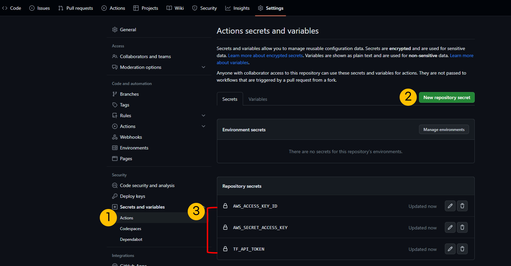
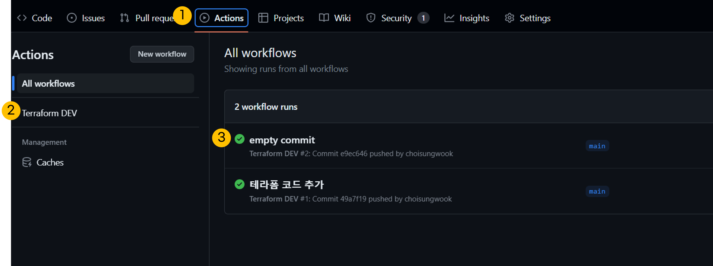

# 개요
* github action과 TFC(Terraform Cloud) remote state 연동 예제

# 전제조건
* TFC workspace 생성
* [TFC API 토큰](https://app.terraform.io/app/settings/tokens?utm_source=learn) 생성
* AWS 액세스 토큰 생성

# 테라폼 코드 설명
* main.tf는 AWS에 vpc를 생성합니다.

# 예제 실행방법
1. github action secret에 TFC API 토큰과 AWS 액세스 토큰을 설정합니다.
  

2. provider.tf에 TFC workflow를 수정합니다.
```HCL
terraform {
  cloud {
    organization = "example-org-ab72d9" # 테라폼 클라우드 ORG를 설정하세요.
    hostname     = "app.terraform.io"

    workspaces {
      name = "terraform-aws-github-action"
    }
  }
  ...
}
```

3. git push를 하세요.
4. github action이 정상실행되는지 확인하세요



5. aws 콘솔에서 vpc가 생성되었는지 확인하세요.

# AWS 리소스 삭제방법
1. main.tf를 주석하세요
2. git push하세요
3. github action이 정상 실행되었는지 확인하세요.
4. aws vpc가 삭제되었는지 확인하세요.
